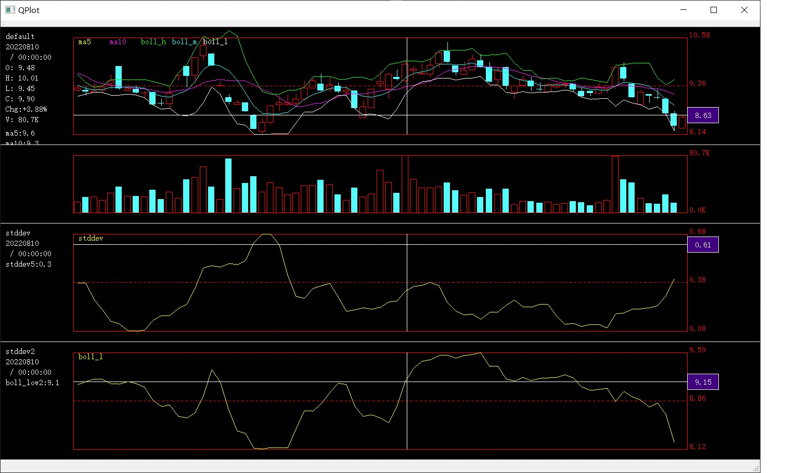

Noise
=====
A Backtest or Trading Framework with C++


Why invent the wheel ?
------------
* Inspired by [backtesting.py](https://kernc.github.io/backtesting.py)
* Not invent, just rewrite it in another way
* Need a simpler, faster, ease of replace component framework


Features
--------
* Simple, no-documented API / structure
* Composable Strategies / Broker / Feed / Ploting
* Support different ways of Backtest (SimpleBroker/BrokerMuxer/EventDriven/PreProcessed)
* Cheap Detailed results
* Cheap visualizations


Requirements
------------
```
- OpenMP [Optional]     maximize 48+ Cores to run
- GCC
- CMAKE
- No "extra" libs, except for those tiny one already included in directory: noise/src/3rd
    - log
    - talib
```


Build on Linux
--------------
```sh
    cd noise
    mkdir build
    cd build
    cmake ..
    make && ./bt
```

Usage
-----
```c
    make && ./bt
```

Results in:

```text
[Stat] summary:
  Start                      [YYYMMDD] 20180102
  End                        [YYYMMDD] 20180213
  Duration                       [days]     112
  Exposure Time                      [%]  99.11
  Equity Final                  [$]    +6277.18
  Equity Peak                   [$]   +10109.52
  PNL                           [$]    -3722.82
  Return                             [%] -37.23
  Buy & Hold Return                  [%]  -8.54
  Return (Ann.)                      [%]   0.00 TBD
  Volatility (Ann.)                  [%]   0.00 TBD
  Sharpe Ratio                             0.00 TBD
  Max. Drawdown                      [%]   0.00 TBD
  Avg. Drawdown                      [%]   0.00 TBD
  Max. Drawdown Duration         [days]    0.00 TBD
  Avg. Drawdown Duration         [days]    0.00 TBD
  Trades                                     57
  Win Rate                           [%]  35.09
  Avg. Trade                         [%]  -3.99
  Best. Trade                        [%]  11.11
  Wors. Trade                        [%] -17.50
  Best. Trade on PNL             [$]     +40.85
  Wors. Trade on PNL             [$]    -246.01
  Max. Trade Duration           [days]   108.00
  Avg. Trade Duration           [days]    51.63
  SQN                                     -5.53

[main] time elapsed: 12.594399 ms
```

Find more usage examples in dir noise/src/sample/


Build on Windows with GUI Ploting
--------------
```sh
    cd noise
    mkdir build
    cd build
    cmake ../noise/sample/cd
    open noise.sln with VisualStudio
    build and run
```


Contibutes
----------
- Always welcomed ( Feature or Bugfix or Unitest )
- Platform Independent
- Simple is the most important thing. No heavy / fancy code. No 3rd library.
- Keep less code

Final
-----
* No Lisence, or [UnLisence](https://unlicense.org/)
* Thanks to [Github](https://github.com/), [kernc](https://github.com/kernc)
* Again, Inspired by [backtesting.py](https://kernc.github.io/backtesting.py)
